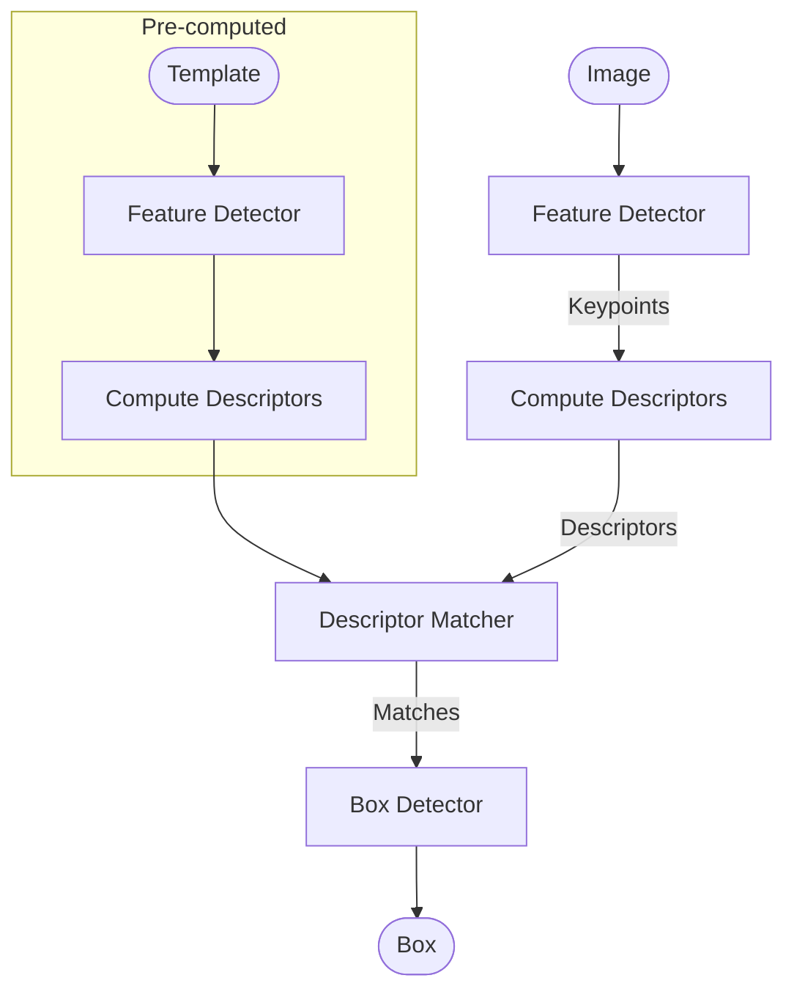

# Template-based feature matching

## Considerations

This approach is appropriate under the following conditions:

- A single template image is available, or there are no real-world images for training.
- The template is distinct and easily identifiable.
- Estimation of the bounding box or the pose is necessary.
- The template in the real-world image is expected to be similar to the template image.

In cases that do not meet these conditions, alternative methods such as object detection or object recognition may be more suitable.

## Overview

## Candidates

Feature detector and descriptor:

- SIFT
- SURF
- ORB (\*)
- AKAZE (\*)
- BRISK
- KAZE

Detector only:

- FAST
- OFAST

Descriptor only:

- BEBLID (\*)
- FREAK (\*)
- KNIFT

Keypoint matcher:

- Brute-force
- FLANN

Box detector:

- RANSAC

Evaluation criteria:

- Number of keypoints
- Number of matches
- Number of inliers
- Index time
- Execution time

## Combinations

Score:

- A: perfect
- B: okay
- C: not fit
- D: perspective failed
- E: convex failed
- F: area failed

| Detector | Descriptor | Matcher     | Box Detector | Note                                  |    A |    B |  Idx Time |    C |    D |    E | Exec Time | Keypoints | Matches | Inliers |    M/K |    I/M | Score  |
| -------- | ---------- | ----------- | ------------ | ------------------------------------- | ---: | ---: | --------: | ---: | ---: | ---: | --------: | --------: | ------: | ------: | -----: | -----: | ------ |
| SIFT     | SIFT       | Brute-force | RANSAC       | Cross check                           | 9.72 | 13.7 |  23.42 ms |  230 |  217 |  197 | 644.00 ms |      3191 |     395 |     160 | 12.38% | 40.51% | A or B |
| KAZE     | KAZE       | Brute-force | RANSAC       | Cross check                           | 87.3 | 47.7 | 135.00 ms |  188 |  169 | 17.0 | 374.00 ms |      2898 |     299 |     153 | 10.31% | 51.17% | A or B |
| SIFT     | SIFT       | Brute-force | RANSAC       | Lowe's ratio                          | 10.0 | 20.0 |  30.00 ms |  126 | 77.5 | 30.3 | 233.80 ms |      3191 |     197 |     131 |  6.17% | 66.50% | A or B |
| SIFT     | SIFT       | FLANN       | RANSAC       | Lowe's ratio                          | 10.1 | 10.8 |  20.90 ms | 42.8 | 54.2 | 50.0 | 147.00 ms |      3191 |     200 |     131 |  6.26% | 65.50% | A or B |
| SIFT     | BEBLID     | Brute-force | RANSAC       | Cross check                           | 9.50 | 1.75 |  11.25 ms |  152 | 27.2 |  136 | 315.20 ms |      3191 |     366 |     163 | 11.47% | 44.54% | B      |
| FAST     | SIFT       | Brute-force | RANSAC       | Cross check                           | 0.34 | 17.3 |  17.64 ms | 2.16 | 96.0 |  155 | 253.16 ms |      7788 |     412 |     158 |  5.29% | 38.35% | B      |
| SIFT     | SIFT       | Brute-force | RANSAC       | Cross check + Limit features 600/1600 | 9.78 | 11.4 |  21.18 ms | 47.2 | 52.0 | 15.2 |  114.4 ms |      1600 |     291 |     123 | 18.19% | 42.26% | B      |
| SIFT     | SIFT       | Brute-force | RANSAC       | Cross check + Limit features 400/3200 | 10.1 | 10.5 |  20.60 ms | 51.9 | 65.0 | 26.9 |  143.8 ms |      3191 |     274 |     122 |  8.60% | 44.53% | C      |
| SIFT     | SIFT       | Brute-force | RANSAC       | Cross check + Limit features 400/1600 | 10.2 | 8.64 |  18.84 ms | 53.1 | 45.2 | 10.9 |  109.2 ms |      1600 |     252 |     118 | 15.75% | 46.83% | C      |
| BRISK    | BRISK      | Brute-force | RANSAC       | Cross check                           | 10.3 | 5.33 |  15.63 ms | 61.0 | 51.0 |  154 | 266.00 ms |      6937 |     473 |      87 |  6.82% | 18.40% | C      |
| AKAZE    | AKAZE      | Brute-force | RANSAC       | Cross check                           | 7.62 | 8.18 |  15.80 ms | 35.6 | 35.3 | 7.96 |  78.86 ms |      2369 |     211 |      86 |  8.91% | 40.76% | C      |
| SIFT     | SIFT       | Brute-force | RANSAC       | Cross check + Limit features 600/800  | 10.6 | 12.2 |   22.8 ms | 53.4 | 84.7 | 9.02 | 147.12 ms |       800 |     217 |      82 | 27.13% | 37.79% | C      |
| ORB      | ORB        | Brute-force | RANSAC       | Cross check + No limit (3000)         | 1.54 | 1.56 |   3.10 ms | 9.16 | 6.00 | 21.5 |  36.66 ms |      2980 |     437 |      76 | 14.66% | 17.39% | C      |
| SIFT     | SIFT       | Brute-force | RANSAC       | Cross check + Limit features 400/800  | 10.1 | 9.32 |  19.42 ms | 44.6 | 35.9 | 5.26 |  85.76 ms |       800 |     199 |      69 | 24.88% | 34.67% | C      |
| SIFT     | SIFT       | Brute-force | RANSAC       | Cross check + Limit features 400/400  | 10.5 | 11.2 |   21.7 ms | 48.6 | 31.0 | 2.33 |  81.93 ms |       401 |     140 |      48 | 34.91% | 34.29% | C      |
| ORB      | KNIFT      | Brute-force | RANSAC       | Cross check + No limit (3000)         | 1.15 | 56.5 |  57.65 ms | 8.13 |  338 | 27.9 | 374.03 ms |      3000 |     109 |      39 |  3.63% | 35.78% | C      |
| ORB      | BEBLID     | Brute-force | RANSAC       | Cross check                           | 2.13 | 0.83 |   2.96 ms | 4.79 | 1.02 | 2.07 |   7.88 ms |       500 |     136 |      33 | 27.20% | 24.26% | C      |
| ORB      | ORB        | Brute-force | RANSAC       | Cross check + No limit (500)          |      |      |   2.72 ms |      |      |      |   9.31 ms |       500 |     131 |      23 | 26.20% | 17.56% | C      |
| SIFT     | SIFT       | Brute-force | RANSAC       | Cross check + Limit features 400/200  | 9.53 | 8.88 |  18.41 ms | 43.5 | 28.4 | 1.38 |  73.28 ms |       202 |      88 |      15 | 43.56% | 17.05% | C      |
| ORB      | ORB        | Brute-force | RANSAC       | Cross check                           | 1.11 | 0.82 |   1.93 ms | 3.84 | 1.30 | 0.84 |   5.98 ms |       200 |      76 |      11 | 38.00% | 14.47% | C      |
| ORB      | KNIFT      | Brute-force | RANSAC       | Cross check                           | 1.06 | 27.4 |  28.46 ms | 3.88 | 14.2 | 0.68 |  18.76 ms |       200 |      16 |       7 |  8.00% | 43.75% | D      |
| FAST     | SIFT       | Brute-force | RANSAC       | Lowe's ratio                          | 0.36 | 14.8 |  15.16 ms | 1.98 | 97.8 | 67.4 | 167.18 ms |      7788 |       7 |       5 |  0.09% | 71.43% | E      |
| OFAST    | ORB        | Brute-force | RANSAC       | Cross check                           | 1.01 | 0.87 |   1.88 ms | 4.42 | 1.98 | 1.41 |   7.81 ms |       214 |      88 |       8 | 41.12% |  9.09% | F      |
| FAST     | FREAK      | Brute-force | RANSAC       | Cross check                           | 0.32 | 3.37 |   3.69 ms | 2.01 | 37.1 |  154 | 193.11 ms |      7788 |     405 |       7 |  5.20% |  1.73% | F      |
| OFAST    | KNIFT      | Brute-force | RANSAC       | Cross check                           | 0.96 | 21.6 |  22.56 ms | 4.23 | 19.5 | 0.98 |  24.71 ms |       214 |       9 |       5 |  4.21% | 55.56% | F      |
| ORB      | ORB        | Brute-force | RANSAC       | Lowe's ratio                          | 1.07 | 0.91 |   1.98 ms | 4.08 | 1.42 | 0.50 |   6.00 ms |       200 |      12 |       5 |  6.00% | 41.67% | F      |
| OFAST    | ORB        | Brute-force | RANSAC       | Lowe's ratio                          | 1.02 | 1.00 |   2.02 ms | 4.15 | 1.93 | 0.57 |   6.65 ms |       214 |       9 |       4 |  4.21% | 44.44% | F      |

## Conclusion

- The tested template is not a good template
- ORB is acceptable with real-time performance
- KNIFT help increase matches quality
- SIFT is the most robust but slowest
- Other optimizations for SIFT:
  - Use FAST for detection
  - Use BEBLID for descriptor
  - Limit the number of features (must be carefully chosen)
- Matching algorithm:
  - Brute-force + cross check is the most robust
  - FLANN is faster, but less robust
  - Brute-force + Lowe's ratio test is in between

## Side-question

### Why ARToolkit5 is so fast?

Demo: <https://ar-js-org.github.io/.github/profile/aframe/examples/image-tracking/nft/>
Marker: <https://raw.githubusercontent.com/AR-js-org/AR.js/master/aframe/examples/image-tracking/nft/trex-image-big.jpeg>

Code reference:

- <https://github.com/Carnaux/NFT-Marker-Creator/blob/dev/emscripten/assemble.c>
- <https://github.com/artoolkitx/artoolkit5/blob/master/lib/SRC/KPM/kpmHandle.cpp>

### Apply template matching to crop the ID card

Template: <https://rnd.3forcom.org/id-card/cccd-front.jpeg>
Demo: <https://rnd.3forcom.org/id-card/>
